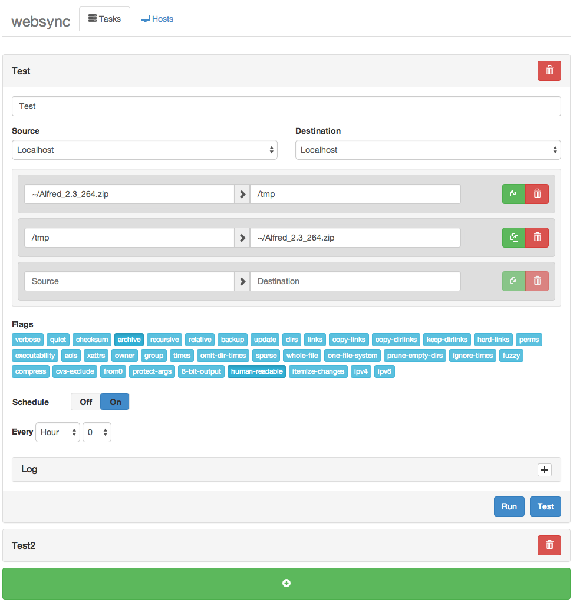
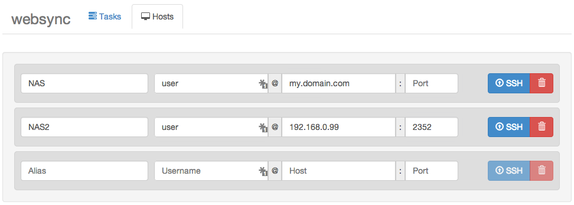

# **websync is no longer maintained**
Feel free to use websync if it works for you, otherwise you need to make a fork and fix any and all issues without my help.

# **websync**

_websync is intended to be an **rsync task manager**, where rsync tasks can be added, scheduled and maintained in a sane manner._

## Table of content

- [Installation](#installation)
- [Screenshots](#screenshots)
- [Features](#features)
- [websync@docker](#websyncdocker)
- [Bugs & Requests/Enhancments](#bugs--requestsenhancments)
- [Roadmap](#roadmap)
- [Collaborate](#collaborate)
- [Contact](#contact)
- [FAQ](https://github.com/furier/websync/wiki/FAQ)
- [License](#license---mit)

## Installation

- [OS X](https://github.com/furier/websync/wiki/Installation---OS-X)
- [Ubuntu 12.04](https://github.com/furier/websync/wiki/Installation---Ubuntu-12.04)
- [Debian 6](https://github.com/furier/websync/wiki/Installation-Debian-6)
- Should work for any unix like system.

## Screenshots

### Tasks tab

### Hosts tab

## Features

- All
  - Every change is auto synchronized with the back end, no manual saving is required!
  - Data is stored in a simple json file on disk!

- Tasks
  - Create
  - Edit
  - Remove
  - Clone
  - Schedule
  - Multiple paths defined for one task.
  - Either source or destination can be a remote target, as long as a passwordless ssh RSA key (for the host running websync) has been added to authorized hosts on the remote target.
  - Realtime logs for each task in the browser.
  - Test and Run on demand.

- Hosts
  - Create
  - Edit
  - Remove
  - ssh-copy-id to remote targets

## websync@docker

websync can now be found @ docker, get it [here](https://registry.hub.docker.com/u/furier/websync/)!

All you have to do is

    sudo docker pull furier/websync
    sudo docker run -d -p 3000:3000 -v /path/to/share:/path/to/share -w /src furier/websync node server.js
    
and you are done!

## Bugs & Requests/Enhancments

Please file an issue report if you find a bug, or have any other request, suggestion etc!

## Roadmap

- **File Browser**, which can browse both localhost and remote targets.
- **Path autocompletion** for both localhost and remote targets when just typing the paths manually in the path list for each task.
- **Progressbars** to view total task progress, individual task progress and for each file!

## Collaborate

- Collaborators are very welcome, contact me!
- Pull requests are also welcome, fork me and send me a pull request!

## Contact

- Authors
  - Sander Struijk - furier84+github@gmail.com

## LICENSE - MIT
